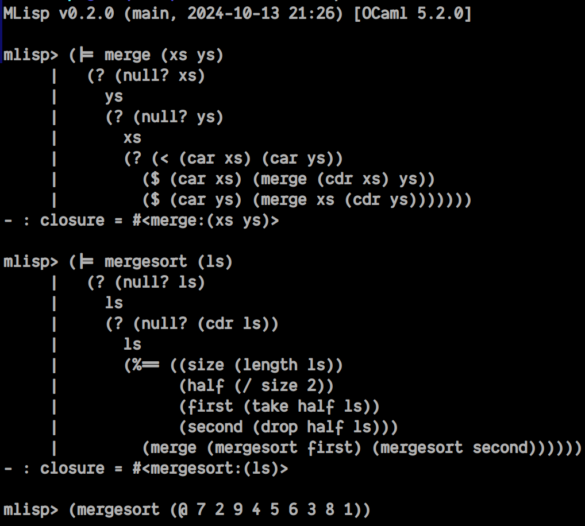

<div align="center">


# MLisp

*A Lisp dialect implementation in OCaml*

</div>



## Table of Contents

- [Introduction](#introduction)
- [Installation](#installation)
- [Language Overview](#language-overview)
- [Data Types](#data-types)
- [Expressions and Control Flow](#expressions-and-control-flow)
- [Functions and Closures](#functions-and-closures)
- [Variable Bindings](#variable-bindings)
- [Modules](#modules)
- [Macros](#macros)
- [Standard Library](#standard-library)
- [Examples](#examples)
- [License](#license)

## Introduction

MLisp is a Lisp dialect implemented in OCaml, featuring a clean syntax, lexical scoping, closures, modules, and a macro system. It provides a REPL (Read-Eval-Print Loop) for interactive development and supports both interactive and file-based execution.

## Installation

### Prerequisites

- OCaml 5.0 or later
- Dune build system
- Core library and dependencies (see `mlisp.opam`)

### Building

```bash
# Clone the repository
git clone <repository-url>
cd mlisp

# Install dependencies
opam install . --deps-only

# Build the project
dune build

# Install globally (optional)
dune install
```

### Running

```bash
# Start the REPL
dune exec mlisp

# Run a MLisp file
dune exec mlisp -- <file.mlisp>
```

## Language Overview

MLisp uses S-expression syntax with prefix notation. All expressions are evaluated in a functional style with lexical scoping.

### Basic Syntax

- **Comments**: Lines starting with `;;` are comments
- **S-expressions**: `(function arg1 arg2 ...)`
- **Quoting**: Use `` ` `` for quoting expressions: `` `foo`` or `(quote foo)`

## Data Types

### Numbers

MLisp supports integers and floating-point numbers:

```lisp
42          ;; Integer
-17         ;; Negative integer
3.14        ;; Float
```

### Booleans

```lisp
#t          ;; True
#f          ;; False
```

### Strings

```lisp
"hello"     ;; String literal
"world"     ;; Another string
""          ;; Empty string
(@ "Hello" " " "World")  ;; String concatenation: "Hello World"
```

### Symbols

Symbols are identifiers used for variable names and function names:

```lisp
foo         ;; Symbol (when evaluated)
`foo        ;; Quoted symbol
```

### Lists and Nil

Lists are constructed using cons pairs, and `nil` represents the empty list:

```lisp
nil         ;; Empty list
(cons 1 (cons 2 nil))  ;; List: (1 2)
(list 1 2 3)           ;; List constructor: (1 2 3)
(car '(1 2 3))         ;; 1 (first element)
(cdr '(1 2 3))         ;; (2 3) (rest of list)
(atom? x)              ;; #t if x is an atom, #f if it's a pair
```

### Records

Records provide structured data:

```lisp
(record 'point (list (list 'x 10) (list 'y 20)))
(record-get point-record 'x)  ;; Access field
```

## Expressions and Control Flow

### Arithmetic Operations

All arithmetic operators support variadic arguments:

```lisp
(+ 1 2)           ;; 3
(+ 10 20 30)      ;; 60
(- 10 5)          ;; 5
(- 100 30 20)     ;; 50
(* 3 4)           ;; 12
(* 2 3 4)         ;; 24
(/ 10 2)          ;; 5
(/ 100 10 2)      ;; 5
(% 10 3)          ;; 1 (modulo)
```

### Comparison Operators

```lisp
(== 5 5)          ;; #t (equality)
(!= 5 6)          ;; #t (inequality)
(< 5 10)          ;; #t (less than)
(<= 5 10)         ;; #t (less than or equal)
(> 10 5)          ;; #t (greater than)
(>= 10 5)         ;; #t (greater than or equal)
```

### Conditional Expressions

#### If Expression

```lisp
(if #t 1 2)                    ;; Returns 1
(if #f 1 2)                    ;; Returns 2
(if (> 5 3) "yes" "no")        ;; Returns "yes"
```

#### Cond Expression

```lisp
(cond ((< 5 3) 1)
      ((> 5 3) 2)
      ((== 5 3) 3))            ;; Returns 2
```

#### Logical Operators

```lisp
(and #t #t)                    ;; #t
(and #t #f)                    ;; #f
(or #t #f)                     ;; #t
(or #f #f)                     ;; #f
```

#### Begin Expression

The `begin` form sequences multiple expressions and returns the value of the last one:

```lisp
(begin
  (print "First")
  (print "Second")
  42)                          ;; Returns 42, prints "First" and "Second"
```

#### Quote

Use `quote` or `'` to prevent evaluation:

```lisp
(quote foo)                    ;; Symbol foo (unevaluated)
'foo                          ;; Same as (quote foo)
(quote (1 2 3))              ;; List (1 2 3) (unevaluated)
```

#### Quasiquote

Quasiquote (backtick) allows constructing S-expressions with selective evaluation:

- `` `expr `` - Quasiquote: most content is literal (like quote)
- `,expr` - Unquote: evaluate and insert the value
- `,@expr` - Unquote-splicing: evaluate and splice a list into the surrounding list

```lisp
;; Basic quasiquote behaves like quote
`(1 2 3)                      ;; (1 2 3)

;; Unquote - insert evaluated value
(define x 42)
`(1 ,x 3)                     ;; (1 42 3)

;; Multiple unquotes
(define y 10)
`(,x ,y)                      ;; (42 10)

;; Unquote-splicing - splice a list into the result
(define nums '(2 3 4))
`(1 ,@nums 5)                 ;; (1 2 3 4 5)

;; Nested quasiquotes (comma-comma evaluates at level 2)
`` `(1 ,,x)                   ;; `(1 ,42)
```

Quasiquote is especially useful for writing macros that generate code.

## Functions and Closures

### Lambda Expressions

```lisp
(lambda (x y) (+ x y))         ;; Anonymous function
(define add (lambda (x y) (+ x y)))
(add 5 3)                      ;; 8
```

### Function Definition

The `defun` form provides a convenient way to define named functions:

```lisp
(defun square (n) (* n n))
(square 5)                     ;; 25
```

### Recursive Functions

```lisp
(defun factorial (n)
  (if (== n 0)
      1
      (* n (factorial (- n 1)))))
(factorial 5)                  ;; 120
```

### Closures

MLisp supports lexical scoping and closures:

```lisp
(define make-adder (lambda (n) 
  (lambda (x) (+ x n))))
(define add5 (make-adder 5))
(add5 10)                       ;; 15
```

### Higher-Order Functions

```lisp
(define apply-twice (lambda (f x) (f (f x))))
(defun inc (n) (+ n 1))
(apply-twice inc 5)            ;; 7
```

### Apply

The `apply` function applies a function to a list of arguments:

```lisp
(define nums '(1 2 3 4 5))
(apply + nums)                 ;; 15

(define args '(6 7))
(apply * args)                  ;; 42
```

## Variable Bindings

### Define

Global variable definition:

```lisp
(define x 42)
(define y (+ 5 3))
(define greeting "Hello")
```

### Let Bindings

#### Let

Parallel bindings (evaluated simultaneously):

```lisp
(let ((x 5)
      (y 10))
  (+ x y))                     ;; 15
```

#### Let*

Sequential bindings (evaluated in order):

```lisp
(let* ((x 5)
       (y (* x 2)))
  y)                           ;; 10
```

#### Letrec

Recursive bindings for mutually recursive functions:

```lisp
(letrec ((is-even
          (lambda (n)
            (if (== n 0)
                #t
                (is-odd (- n 1)))))
         (is-odd
          (lambda (n)
            (if (== n 0)
                #f
                (is-even (- n 1))))))
  (is-even 10))                ;; #t
```

## Modules

MLisp provides a module system for code organization and encapsulation.

### Module Definition

```lisp
(module math-constants (export pi e)
  (define pi 3.14159)
  (define e 2.71828))
```

### Import

```lisp
;; Import all exports
(import math-constants)
pi                             ;; 3.14159

;; Selective import
(import arithmetic add subtract)
(add 10 5)                     ;; 15

;; Import with alias
(import string-utils :as str)
```

### Module with Functions

```lisp
(module arithmetic (export add subtract multiply)
  (define add (lambda (x y) (+ x y)))
  (define subtract (lambda (x y) (- x y)))
  (define multiply (lambda (x y) (* x y))))
```

## Macros

MLisp supports macros for metaprogramming and code generation. Macros receive their arguments as unevaluated S-expressions and return S-expressions that are then evaluated.

### Macro Definition

```lisp
(defmacro double (x)
  `(+ ,x ,x))

(define result (double 5))    ;; Expands to (+ 5 5) = 10
```

### Quasiquoted Macros

Using quasiquote makes macros more readable:

```lisp
;; When macro - execute body only if condition is true
(defmacro when (condition body)
  `(if ,condition ,body nil))

(when #t (print "Hello"))      ;; Prints "Hello"
(when #f (print "Hello"))      ;; Does nothing

;; Unless macro - opposite of when
(defmacro unless (condition body)
  `(if (not ,condition) ,body nil))

(unless #f (print "Hi"))       ;; Prints "Hi"
```

### Unquote-splicing in Macros

Use `,@` to splice a list into the generated code:

```lisp
;; Macro that creates a function comparing to multiple values
(defmacro member-of (x)
  `(lambda (y) (or ,@(map (lambda (v) `(== ,y ,v)) x))))

(define is-digit (member-of '(0 1 2 3 4 5 6 7 8 9)))
(is-digit 5)                   ;; #t
(is-digit 42)                  ;; #f
```

### Hygienic Macros with Gensym

Use `gensym` to generate unique symbols and avoid variable capture:

```lisp
;; Generate unique symbols
(gensym)                      ;; => g1
(gensym "temp")               ;; => temp_1
(gensym "temp")               ;; => temp_2

;; Hygienic swap macro using gensym
(defmacro swap (a b)
  (let ((temp (gensym "temp")))
    `(let ((,temp ,a))
       (setq ,a ,b)
       (setq ,b ,temp))))

(define x 10)
(define y 20)
(swap x y)
x                             ;; 20
y                             ;; 10
```

### Alternative Style (Without Quasiquote)

For completeness, macros can also be written using `list` and `quote`:

```lisp
;; Same when macro without quasiquote
(defmacro when-alt (condition body)
  (list 'if condition body (quote nil)))
```

However, the quasiquote style is generally preferred for readability.

### Macro Debugging Tools

MLisp provides tools to inspect macro expansion, which are helpful for understanding how macros transform code.

#### `macroexpand-1`

Expand a macro call by a single level, without recursively expanding nested macros:

```lisp
(defmacro square (x)
  `(* ,x ,x))

(defmacro double-square (x)
  `(double (square ,x)))

;; Single-step expansion - only the outer macro is expanded
(macroexpand-1 '(double-square 5))
;; => (double (square 5))
```

#### `macroexpand`

Fully expand all macros recursively until no macro calls remain:

```lisp
;; Full expansion - all macros are expanded
(macroexpand '(double-square 5))
;; => (* (* 5 5) (* 5 5))
```

These tools are invaluable for debugging complex macros that expand to other macros.

## Standard Library

MLisp includes a comprehensive standard library loaded automatically.

### List Operations

```lisp
(null? '())                    ;; #t
(length '(1 2 3))              ;; 3
(append. '(1 2) '(3 4))        ;; (1 2 3 4)
(take 2 '(1 2 3 4))           ;; (1 2)
(drop 2 '(1 2 3 4))           ;; (3 4)
(mergesort '(3 1 4 2))        ;; (1 2 3 4)
(zip. '(1 2) '(a b))          ;; ((1 a) (2 b))
```

### Primitive List Functions

```lisp
(cons 1 '(2 3))                ;; (1 2 3)
(car '(1 2 3))                 ;; 1
(cdr '(1 2 3))                 ;; (2 3)
(list 1 2 3)                   ;; (1 2 3)
(atom? x)                      ;; #t if x is an atom
(symbol? x)                     ;; #t if x is a symbol
```

### Core Functions

```lisp
(null. x)                      ;; Check if list is empty
(and. x y)                     ;; Logical AND
(not. x)                       ;; Logical NOT
(caar ls)                      ;; (car (car ls))
(cadr ls)                      ;; (car (cdr ls))
```

### Input/Output

```lisp
(print "Hello")                ;; Print to stdout
(println "Hello")              ;; Print with newline
(getline)                      ;; Read a line from stdin
(getchar)                      ;; Read a character (returns integer)
```

### Type Conversion

```lisp
(int->char 65)                 ;; Convert integer to character symbol
(symbol-concat 'a 'b)          ;; Concatenate two symbols
```

### Assertions

```lisp
(assert (= result 10))         ;; Assert condition
```

## Examples

### Factorial

```lisp
(defun factorial (n)
  (if (== n 0)
      1
      (* n (factorial (- n 1)))))

(factorial 5)                  ;; 120
```

### Fibonacci

```lisp
(defun fib (n)
  (if (< n 2)
      n
      (+ (fib (- n 1)) (fib (- n 2)))))

(fib 8)                        ;; 21
```

### Counter Closure

```lisp
(define make-counter (lambda ()
  (let ((count 0))
    (lambda ()
      (define count (+ count 1))
      count))))

(define counter1 (make-counter))
(counter1)                     ;; 1
(counter1)                     ;; 2
(counter1)                     ;; 3
```

### Module Example

```lisp
(module counter-mod (export increment get-count reset)
  (define count 0)
  (define increment (lambda ()
    (define count (+ count 1))
    count))
  (define get-count (lambda () count))
  (define reset (lambda ()
    (define count 0)
    count)))

(import counter-mod)
(increment)                    ;; 1
(increment)                    ;; 2
(get-count)                    ;; 2
(reset)                        ;; 0
```

## License

This Source Code Form is subject to the terms of the
Mozilla Public License, v. 2.0. If a copy of the MPL was not distributed
with this file, You can obtain one at http://mozilla.org/MPL/2.0/.
